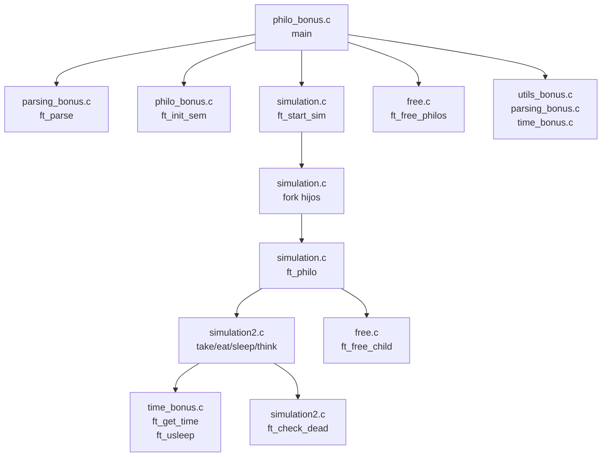
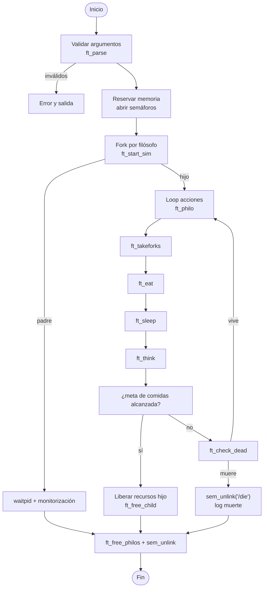

# Philosophers Bonus – Architectural Notes

## Contexto y requisitos
- Basado en el subject `philosophers_bonus` de 42: cada filósofo vive en un proceso hijo independiente.
- La sincronización se realiza exclusivamente mediante semáforos POSIX con nombre; queda prohibido usar mutexes o memoria compartida sin control.
- El proyecto debe respetar tiempos en milisegundos (`time_to_die`, `time_to_eat`, `time_to_sleep`) y detener la simulación en cuanto un filósofo muere o todos han comido lo suficiente.
- El binario oficial es `philo_bonus`, orquestado por un `Makefile` que ofrece `make`, `make clean` y `make fclean`.

## Tecnologías utilizadas
- **C + POSIX**: `fork`, `waitpid`, `gettimeofday`, `usleep`, `exit` para gestionar procesos y tiempos.
- **Semáforos POSIX con nombre**: `/forks`, `/printer`, `/seats`, `/die` gestionan recursos compartidos y parada global.
- **Biblioteca estándar**: `malloc`, `free`, `printf`, `errno`.
- **GNU Make**: Compilación declarativa con flags de depuración (`-g -O3 -pthread`).
- **Bash**: Scripts de pruebas (`test_wo_valgrind.sh`, `test.sh`, etc.) para ejecutar escenarios repetibles.

## Visión arquitectónica
- **`philo_bonus.c`** actúa como *composition root*: valida argumentos, instancia `t_table`, abre semáforos, crea cada `t_philo` y lanza la simulación.
- **`simulation.c`** controla el ciclo de vida de cada proceso-hijo. `ft_start_sim` realiza los `fork`, mientras `ft_philo` ejecuta el bucle principal de acciones.
- **`simulation2.c`** contiene la lógica atómica de cada acción (`ft_takeforks`, `ft_eat`, `ft_sleep`) y las comprobaciones de muerte `ft_check_dead`, apoyada en semáforos para evitar condiciones de carrera.
- **`time_bonus.c`** encapsula utilidades de tiempo (`ft_get_time`, `ft_usleep`) para mantener el control milimétrico exigido.
- **`parsing_bonus.c` y `utils_bonus.c`** agrupan utilidades de parseo (`ft_atoi`, validaciones) y funciones auxiliares (`ft_calloc`, `ft_strlen`, `ft_itoa`).
- **`free.c`** centraliza la liberación de recursos y el cierre/unlink correcto de cada semáforo tanto en padre como en hijos.
- **`tests.c` y scripts en `tests/`** proveen escenarios manuales y automatizados siguiendo las recomendaciones del subject.

## Estructura de carpetas y archivos
```
.
├── Makefile
├── philo_bonus.c
├── philo_bonus.h
├── parsing_bonus.c
├── simulation.c
├── simulation2.c
├── time_bonus.c
├── utils_bonus.c
├── free.c
├── tests.c
├── tests/
│   ├── README
│   └── tester
├── scripts de ayuda: test.sh, test_wo_valgrind.sh, hell_test.sh, test_hel.sh
├── documentación: es.subject.pdf, AGENTS.md, ERRORS.md, SUGEESTIONS.md
└── logs y auxiliares: log.txt, error_log.txt, obj_h/
```

## Diagrama de arquitectura


## Flujo de ejecución


## Observaciones clave
- El semáforo `/seats` limita cuántos filósofos pueden intentar tomar tenedores simultáneamente, evitando el deadlock clásico.
- La bandera global `/die` se usa como latch: cuando un proceso detecta una muerte, la unlinkea, permitiendo que los demás procesos salgan limpiamente.
- `ft_usleep` combina comprobaciones periódicas con descansos cortos para responder rápido a eventos de muerte sin saturar la CPU.
- Los scripts de pruebas eliminan restos de semáforos en `/dev/shm` entre ejecuciones, requisito habitual del subject para evitar interferencias.
