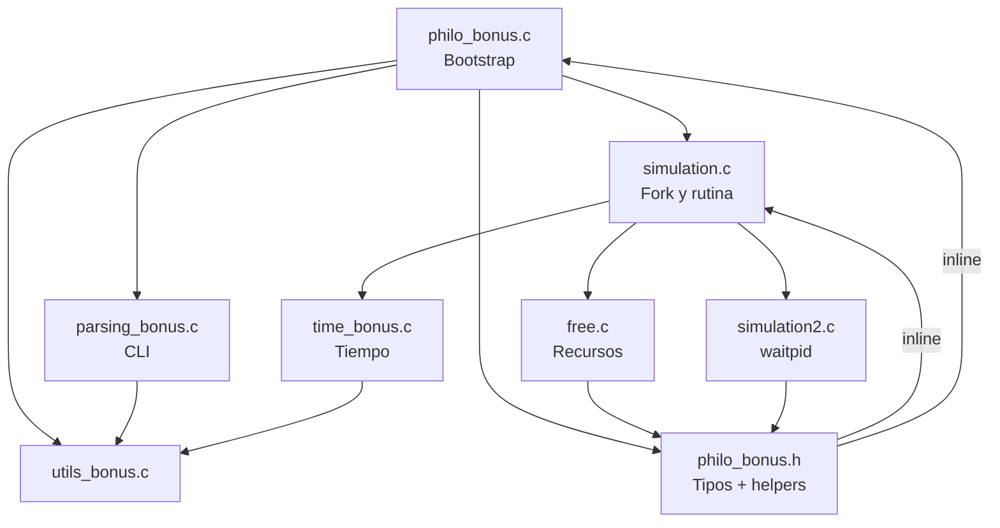

# philo_bonus - Analisis Arquitectonico

Este documento resume la arquitectura del proyecto **philo_bonus** (version bonus del clasico Dining Philosophers) siguiendo las pautas del subject de 42. Incluye el inventario de tecnologias, la organizacion de carpetas y dos diagramas Mermaid que ilustran la arquitectura logica y el flujo principal del programa.

## Arquitectura general
- La entrada `philo_bonus.c` valida argumentos, reserva la estructura `t_table`, inicializa semaforos POSIX nombrados (`/forks`, `/printer`, `/die`, `/seats`) y crea un arreglo de `t_philo`.
- `simulation.c` arranca un proceso por filosofo mediante `fork()`, entrega la rutina `ft_philo` a cada hijo y conserva la sincronizacion a traves de los semaforos compartidos.
- Las operaciones atomicas (tomar tenedores, comer, dormir, pensar) residen como `static inline` en `philo_bonus.h`, reutilizando `ft_sems_wait/post`, `ft_check_dead` y los helpers de tiempo.
- `simulation2.c` encapsula el `waitpid` sobre todos los hijos para que el proceso padre recoja sus estados y pueda liberar recursos de forma ordenada.
- `free.c` centraliza la liberacion de estructuras y el cierre/unlink seguro de cada semaforo en rutas de exito y error.
- El subject exige mantener el formateo exacto de los mensajes, evitar condiciones de carrera y detener la simulacion al morir un filosofo o cumplir el cupo opcional de comidas; estos comportamientos se implementan mediante la combinacion de semaforos y comprobaciones periodicas de tiempo (`ft_get_time`, `ft_usleep`).

## Tecnologias utilizadas
- Lenguaje C (estandar 42) con practicas Norme.
- API POSIX: `fork`, `waitpid`, `gettimeofday`, `usleep`.
- Semaforos POSIX nombrados (`sem_open`, `sem_wait`, `sem_post`, `sem_close`, `sem_unlink`).
- Herramientas de compilacion: `Makefile`, `cc`, flags `-Wall -Wextra -Werror`.
- Scripts Bash de apoyo (`tests/tester`, `test.sh`, `hell_test.sh`) y harness de logging.
- Valgrind opcional a traves del tester para comprobaciones de memoria.

## Estructura de carpetas y archivos
- `philo_bonus.c`: punto de entrada, parseo y bootstrap de semaforos.
- `parsing_bonus.c`: validacion y conversion de argumentos CLI hacia `t_table`.
- `simulation.c`: ciclo padre-hijo y logica principal de cada proceso filosofo.
- `simulation2.c`: utilidades de espera (`waitpid`) para recolectar pids.
- `philo_bonus.h`: definiciones de `t_table`, `t_philo`, prototipos y helpers inline de sincronizacion.
- `utils_bonus.c`: utilidades basicas (`ft_calloc`, `ft_strlen`, `ft_itoa`, `ft_atoi`).
- `time_bonus.c`: abstracciones de temporizacion (`ft_get_time`, `ft_usleep`).
- `free.c`: funciones de limpieza (`ft_free_philos`, `ft_close_sems`, etc.).
- `tests.c`: campo de pruebas puntual para experimentar con funciones aisladas.
- `tests/`: harness determinista (`tests/tester`), README y logs historicos bajo `tests/logs/`.
- `Makefile`: objetivo principal `philo_bonus` y variante `philo_hel` con flags de sanitizado.
- `*.sh` (`test.sh`, `hell_test.sh`, `test_wo_valgrind.sh`): scripts auxiliares para ejecuciones repetitivas.
- `es.subject.pdf`: subject oficial en castellano (fuente de requisitos de concurrencia y formato de salida).

## Diagrama de arquitectura


## Flujo del programa
```mermaid
graph TD
    A["Inicio main()"] --> B["Validar argumentos"]
    B --> C["Reservar t_table y semaforos"]
    C --> D["Crear arreglo de t_philo"]
    D --> E["Fork por filosofo"]
    E --> F{"Proceso hijo?"}
    F -- "Si" --> G["Inicializar marcas de tiempo"]
    G --> H["Tomar asientos y forks"]
    H --> I["Comer (ft_eat)"]
    I --> J["Dormir (ft_sleep)"]
    J --> K["Pensar (ft_think)"]
    K --> L{"Limite de comidas o muerte?"}
    L -- "No" --> H
    L -- "Si" --> M['Sem_unlink("/die") y salida hijo']
    F -- "No" --> N["waitpid sobre hijos"]
    N --> O["Liberar semaforos y memoria"]
    O --> P["Fin"]
```

## Notas adicionales del subject
- Se requiere generar un proceso por filosofo en la version bonus; la gestion de semaforos nombrados evita compartir memoria mediante `pthread`.
- El formato de salida debe permanecer `<timestamp> ms <id> <accion>` sin desviaciones; el control centralizado del semaforo `/printer` cumple este requisito.
- Para evitar deadlocks, se limita el aforo de comensales mediante el semaforo `/seats` (valor inicial `n_philos / 2` segun recomendacion del subject).
- El subject advierte sobre semaforos persistentes en `/dev/shm`; el proyecto incluye cierres y `sem_unlink` en todas las rutas de salida.

## Escenarios de prueba sugeridos
- Ejecutar `make` y luego `./philo_bonus 5 800 200 200 3` para un recorrido basico con limite de comidas.
- Usar `./tests/tester` para reproducir la matriz de escenarios deterministas y capturar logs cronologicos en `tests/logs/<timestamp>/`.
- Limpiar semaforos residuales tras interrupciones con `sem_unlink` manual si es necesario (ver guia en las instrucciones del subject).
